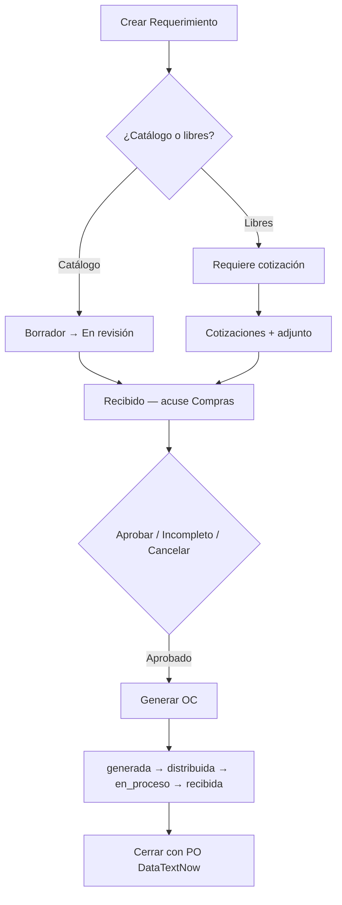

# Sistema de Órdenes de Compra

**Versión 1.7.0** — Agosto 2026

Sistema web para la gestión completa del proceso de compras: **Requerimientos → Cotizaciones → Órdenes de Compra → Recepciones**.

Historial de cambios: [CHANGELOG.md](./CHANGELOG.md) · Cómo versionar: [VERSIONING.md](./VERSIONING.md) · Despliegue: [DESPLIEGUE-v1.7.0.md](./DESPLIEGUE-v1.7.0.md)

## Novedades v1.7.0

- Rol **Compras** (antes Contabilidad) en API, permisos y UI
- **Acuse formal**: estado `recibido` entre *en revisión* y *aprobado*
- **Bandeja**: KPI “Por recibir”, campana de notificaciones y correo al enviar REQ a revisión
- Filtros por solicitante, orden por columnas, export Excel con proveedor + detalle
- Cotización/RFQ: servicios, partes sin precio, No. de parte en correo
- Correcciones de catálogo, import/usuarios y regreso de estados pre-OC

## Características principales

- **Requerimientos** — flujo: borrador → en revisión → **recibido** (acuse Compras) → aprobado / incompleto / cancelado
  - Exclusividad catálogo vs ítems libres (nunca mezclados)
  - Bandeja y campana para Compras (pendientes de acuse)
- **Cotizaciones** con comparación, adjuntos y envío de RFQ por correo (o solo registro)
- **Órdenes de compra** con PO DataTextNow, ciclo de estados y cierre controlado
- **Recepciones** con avance automático de la OC
- **Historial** de cambios de estado por entidad
- **Proveedores, catálogo, usuarios** — roles Admin, Compras, Solicitante
- **Configuración SMTP** desde panel de administración
- **Verificación de correo** al registrarse

## Stack

| Capa | Tecnología |
|------|------------|
| Backend | Node.js, Express 5, MySQL (mysql2), JWT, Multer, Nodemailer, Zod |
| Frontend | HTML, CSS, JavaScript vanilla |
| Módulos | ES Modules, estructura MVC |

## Requisitos

- Node.js 18+
- MySQL 8+

## Instalación

### 1. Clonar e instalar

```bash
git clone <url-del-repositorio>
cd "Sistema de Ordenes de Compra"
cd backend && npm install
```

### 2. Variables de entorno

```bash
# Desde la raíz del proyecto
cp .env.example .env
```

Edita `.env` con credenciales reales de base de datos, JWT, SMTP y (opcional) `EMAIL_NOTIF_COMPRAS`.

### 3. Base de datos

La instalación de producción usa la base `ordenes_compra` ya configurada y poblada.

Para un **ambiente nuevo**, restaura un respaldo del administrador o un dump del esquema y datos iniciales. Al arrancar, el backend aplica migraciones ligeras (ENUM de roles/estados, columnas opcionales).

### 4. Iniciar

```bash
cd backend
npm run dev    # desarrollo (nodemon)
# npm start    # producción
```

Abre `http://localhost:3000`

> El primer usuario administrador se crea/gestiona desde la base o la UI de usuarios (no hay script `seed-admin` en este repo).

## Estructura del proyecto

```
Sistema de Ordenes de Compra/
├── backend/
│   ├── src/
│   │   ├── config/          # db, mailer, env, departamentosStore
│   │   ├── controllers/
│   │   ├── models/
│   │   ├── routes/
│   │   ├── middlewares/
│   │   ├── utils/           # migraciones, email, excel, import
│   │   └── validations/
│   ├── scripts/             # cargar-base-req, vincular-usuarios-import
│   ├── uploads/
│   └── app.js
├── frontend/                # HTML + JS + CSS
├── docs-generados/          # PDFs / material de apoyo (no va al deploy)
├── empaquetar-deploy.ps1
├── DESPLIEGUE-v1.7.0.md
├── CHANGELOG.md
├── VERSIONING.md
├── RECARGAR-BASE-GRAL-SERVIDOR.md
├── .env.example
├── README.md
└── .env                     # No se sube al repositorio
```

## Scripts

| Comando | Descripción |
|---------|-------------|
| `npm run dev` / `npm start` (en `backend/`) | Servidor desarrollo / producción |
| `node backend/scripts/cargar-base-req.mjs` | Import Excel BASE GRAL (`--dry-run` / `--apply`) |
| `node backend/scripts/vincular-usuarios-import.mjs` | Vincular historial import a usuarios activos (`--apply`) |
| `npm run test:ci` (en `backend/`) | CI sin BD (GitHub Actions) |
| `powershell -ExecutionPolicy Bypass -File .\empaquetar-deploy.ps1` | Generar ZIP de deploy |

Detalle de import en servidor: [RECARGAR-BASE-GRAL-SERVIDOR.md](./RECARGAR-BASE-GRAL-SERVIDOR.md).

## Variables de entorno

Ver [`.env.example`](./.env.example) para la lista completa.

| Grupo | Variables | Uso |
|-------|-----------|-----|
| Servidor | `PORT`, `CORS_ORIGIN`, `FRONTEND_URL` | Puerto y URLs |
| Base de datos | `DB_HOST`, `DB_PORT`, `DB_USER`, `DB_PASSWORD`, `DB_NAME` | MySQL |
| Auth | `JWT_SECRET`, `JWT_EXPIRES_IN` | Tokens de sesión |
| Seguridad | `SECRET_ENCRYPTION_KEY` | Encriptación SMTP en DB |
| Correo | `EMAIL_*`, `EMAIL_CC_COTIZACIONES`, `EMAIL_NOTIF_COMPRAS` | SMTP y notificaciones |
| Admin | `ADMIN_*` | Referencia / documentación (no hay seed automático) |

Los administradores pueden configurar SMTP completo (incluido CC de cotizaciones) desde **Administración → Configuración SMTP**. La tabla `configuracion_smtp` tiene prioridad sobre `.env`.

**Nota:** El SMTP suele apuntar al servidor interno de la empresa. En desarrollo local es normal ver un aviso de conexión rechazada; el resto del sistema funciona sin correo.

## Roles y acceso

| Rol | Acceso principal |
|-----|------------------|
| **Solicitante** | Requerimientos propios, catálogo (lectura), OC de sus reqs |
| **Compras** | Flujo completo operativo, proveedores, usuarios (no admin), áreas |
| **Admin** | Todo lo anterior + configuración SMTP |

## Flujo del sistema



### Reglas clave

- Un requerimiento es **solo catálogo** o **solo ítems libres**, nunca ambos
- Compras **acusa recibo** (`recibido`) antes de aprobar
- Ítems libres y servicios habilitan cotización; el email RFQ puede omitirse (solo registro)
- La formalización a catálogo ocurre al **generar la OC**
- Cerrar una OC exige **PO DataTextNow** y recepciones completas
- Estados de OC activos: `generada`, `distribuida`, `en_proceso`, `recibida`

## API principal

| Endpoint | Descripción |
|----------|-------------|
| `GET /api/health` | Estado del servidor + `version` desplegada |
| `GET /api/dashboard/stats` | KPIs del dashboard |
| `GET /api/notificaciones/bandeja` | Bandeja de pendientes (campana) |
| `GET /api/ordenes-compra?estado=activas` | OC pendientes de cerrar |
| `GET /api/areas` | Áreas y departamentos |
| `PATCH /api/requerimientos/:id/estado` | Cambio de estado (incluye `recibido`) |
| `PATCH /api/requerimientos/:id/area-departamento` | Corregir área/depto |

## Actualizar en producción

Guía paso a paso: **[DESPLIEGUE-v1.7.0.md](./DESPLIEGUE-v1.7.0.md)**

Resumen:

1. Respaldar carpeta, `.env` y base MySQL
2. Empaquetar: `powershell -ExecutionPolicy Bypass -File .\empaquetar-deploy.ps1`
3. Descomprimir en el servidor conservando `.env` y `backend/uploads/`
4. `cd backend && npm install --omit=dev`
5. Reiniciar Node/PM2
6. Verificar `GET /api/health` → version `1.7.0`

> v1.7.0 aplica migraciones al arranque (rol `compras` + estado `recibido`). No se requiere SQL manual.

## Notas de producción

- El archivo `.env` va en la **raíz** del proyecto
- Cambiar secretos por defecto después del primer despliegue
- Los archivos subidos se guardan en `backend/uploads/`
- `docs-generados/` y PDFs de apoyo no forman parte del paquete de deploy

## Soporte

Para configuración de base de datos, correo o despliegue, contactar al administrador del sistema.
