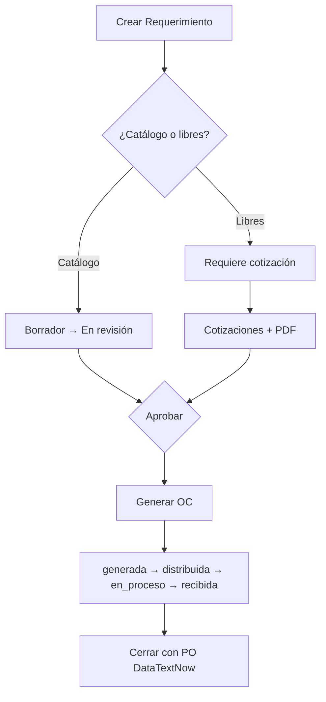

# Sistema de Órdenes de Compra

**Versión 1.0** — Junio 2026

Sistema web para la gestión completa del proceso de compras: **Requerimientos → Cotizaciones → Órdenes de Compra → Recepciones**.

## Novedades v1.0

- **Dashboard** con KPIs en tiempo real, aging de requerimientos en revisión y **OC activas** (pendientes de cerrar)
- **Áreas y departamentos** — catálogo alineado a DataTextNow, editable desde Administración
- **Homologación visual** de badges y estados en catálogo, proveedores y usuarios
- **Filtro `estado=activas`** en el listado de órdenes de compra
- Limpieza de scripts de migración one-time (carga Excel) — la BD de producción ya está poblada

## Características Principales

- **Requerimientos** con flujo de aprobación (borrador → en revisión → aprobado/rechazado/incompleto)
  - Exclusividad catálogo vs ítems libres (nunca mezclados)
- **Cotizaciones** con comparación, PDFs adjuntos y envío de RFQ por correo
- **Órdenes de compra** con herencia de cotización, PO DataTextNow y cierre controlado
- **Recepciones** con avance automático de estado de OC
- **Historial** de cambios de estado por entidad
- **Proveedores, catálogo, usuarios** con roles (Admin, Contabilidad, Solicitante)
- **Configuración SMTP** desde panel de administración
- **Verificación de correo** al registrarse

## Stack

| Capa | Tecnología |
|------|------------|
| Backend | Node.js, Express 5, MySQL (mysql2), JWT, Multer, Nodemailer, Zod |
| Frontend | HTML, CSS, JavaScript vanilla |
| Módulos | ES Modules, estructura MVC |

## Requisitos

- Node.js 18+
- MySQL 8+
- Git

## Instalación

### 1. Clonar e instalar

```bash
git clone <url-del-repositorio>
cd "Sistema de Ordenes de Compra"
cd backend && npm install
```

### 2. Variables de entorno

```bash
# Desde la raíz del proyecto
cp .env.example .env
```

Edita `.env` con credenciales reales de base de datos, JWT, SMTP y admin.

### 3. Base de datos

La instalación de producción utiliza la base de datos `ordenes_compra` ya configurada y poblada.

Para un **ambiente nuevo**, restaura un respaldo proporcionado por el administrador del sistema o solicita el dump del esquema y datos iniciales.

### 4. Usuario administrador

```bash
node backend/scripts/seed-admin.js
```

Usa `ADMIN_EMAIL`, `ADMIN_PASSWORD` y `ADMIN_NOMBRE` del `.env`. El script crea o actualiza el admin y marca el correo como verificado.

### 5. Iniciar

```bash
cd backend
npm run dev    # desarrollo (nodemon)
# npm start    # producción
```

Abre `http://localhost:3000`

## Estructura del Proyecto

```
Sistema de Ordenes de Compra/
├── backend/
│   ├── src/
│   │   ├── config/          # db, mailer, env, departamentos
│   │   ├── controllers/
│   │   ├── models/
│   │   ├── routes/
│   │   ├── middlewares/
│   │   ├── utils/
│   │   └── validations/
│   ├── scripts/
│   │   └── seed-admin.js    # Crear/actualizar administrador
│   ├── uploads/
│   └── app.js
├── frontend/                # HTML + JS + CSS
├── .env.example
├── README.md
└── .env                     # No se sube al repositorio
```

## Scripts

| Comando | Descripción |
|---------|-------------|
| `npm run dev` | Servidor con recarga automática |
| `npm start` | Servidor en modo producción |
| `node backend/scripts/seed-admin.js` | Crear o actualizar usuario administrador |

## Variables de Entorno

Ver [`.env.example`](./.env.example) para la lista completa.

| Grupo | Variables | Uso |
|-------|-----------|-----|
| Servidor | `PORT`, `CORS_ORIGIN`, `FRONTEND_URL` | Puerto y URLs |
| Base de datos | `DB_HOST`, `DB_PORT`, `DB_USER`, `DB_PASSWORD`, `DB_NAME` | MySQL |
| Auth | `JWT_SECRET`, `JWT_EXPIRES_IN` | Tokens de sesión |
| Seguridad | `SECRET_ENCRYPTION_KEY` | Encriptación SMTP en DB |
| Correo | `EMAIL_*`, `EMAIL_CC_COTIZACIONES` | Fallback SMTP |
| Admin | `ADMIN_EMAIL`, `ADMIN_PASSWORD`, `ADMIN_NOMBRE` | Seed inicial |

Los administradores pueden configurar SMTP completo (incluido CC de cotizaciones) desde **Administración → Configuración SMTP**. La tabla `configuracion_smtp` tiene prioridad sobre `.env`.

**Nota:** El SMTP suele apuntar al servidor interno de la empresa (`192.168.x.x`). En desarrollo local es normal ver un aviso de conexión rechazada; el resto del sistema funciona sin correo.

## Roles y Acceso

| Rol | Acceso principal |
|-----|------------------|
| **Solicitante** | Requerimientos propios, catálogo (lectura), OC de sus reqs aprobados |
| **Contabilidad** | Flujo completo operativo, proveedores, usuarios, áreas |
| **Admin** | Todo lo anterior + configuración SMTP |

## Flujo del Sistema



### Reglas clave

- Un requerimiento es **solo catálogo** o **solo ítems libres**, nunca ambos
- Ítems libres siempre requieren cotización; el email RFQ solo aplica a SERVICIOS o libres
- La formalización a catálogo ocurre al **generar la OC** (los libres originales se preservan)
- Cerrar una OC exige **PO DataTextNow** (`datatextnow_id`) y recepciones completas
- Estados de OC activos: `generada`, `distribuida`, `en_proceso`, `recibida`

## API Principal

| Endpoint | Descripción |
|----------|-------------|
| `GET /api/dashboard/stats` | KPIs del dashboard |
| `GET /api/ordenes-compra?estado=activas` | OC pendientes de cerrar |
| `GET /api/areas` | Áreas y departamentos |
| `GET /api/health` | Estado del servidor |

## Notas de Producción

- El archivo `.env` va siempre en la **raíz** del proyecto
- Cambiar credenciales por defecto después del primer despliegue
- Los archivos subidos se guardan en `backend/uploads/`
- El reporte de status PO está disponible para roles contabilidad y admin desde el dashboard

## Soporte

Para configuración de base de datos, correo o despliegue, contactar al administrador del sistema.